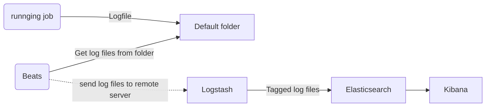

# elk_docker_deployment_records

### elk_deployment.md

0.  about of elk 


The four products are designed for use as an integrated solution, referred to as the "Elastic Stack" (formerly the "ELK stack")
- 0.1 Elasticsearch, is developed alongside a data collection. 
- 0.2 Logstash, log-parsing engine.
- 0.3 Kibana, an analytics and visualisation platform. 
- 0.4 Beats, a collection of lightweight data shippers.




1. pull the elk image

    `docker pull sebp/elk`
    
2. run and exec container from Image
    - 1. run \
    `docker run -p 5601:5601 -p 9200:9200 -p 5044:5044 -p 5000:5000 -it  --name elk sebp/elk`
    - 2. exec : Enter to the container \
    `docker exec -it elk /bin/bash`
    
3. updated the config in container
    - 1.Input: /etc/logstash/conf.d/02-beats-input.conf
    ```
    # before
    input {
        beats {
            port => 5044
            ssl => true
            ssl_certificate => "/etc/pki/tls/certs/logstash-beats.crt"
            ssl_key => "/etc/pki/tls/private/logstash-beats.key"
        }
    }
    ```

    ```
    # after
    input {
        beats {
            port => 5044
            ssl => true
            ssl_certificate => "/etc/pki/tls/certs/logstash-beats.crt"
            ssl_key => "/etc/pki/tls/private/logstash-beats.key"
        }
        tcp{
            port => 5000
        }
        file{
            path => ["/home/forLogstash/*.log"]
            type => "file"
        }
    }
    ```
    - 2.fillter: /etc/logstash/conf.d/10-syslog.conf
    ```
    # before
    filter {
      if [type] == "syslog" {
        grok {
          match => { "message" => "%{SYSLOGTIMESTAMP:syslog_timestamp} %{SYSLOGHOST:syslog_hostname} %{DATA:syslog_program}(?:\[%{POSINT:syslog_pid}\])?: %{GREEDYDATA:syslog_message}" }
          add_field => [ "received_at", "%{@timestamp}" ]
          add_field => [ "received_from", "%{host}" ]
        }
        syslog_pri { }
        date {
          match => [ "syslog_timestamp", "MMM  d HH:mm:ss", "MMM dd HH:mm:ss" ]
        }
      }
    }
    ```
    ```
    # after or create a new config file in the folder
    # debug online https://grokdebug.herokuapp.com/
    filter {
        grok {
            match => ["message", "^\[(?<Date>[^\]]+)\]\s\W\w+\W(?<Client_IP>(\d+.\d+.\d+.\d+))\s,\w+\W(?<Sever_IP>(\d+.\d+.\d+.\d+))\s\W(?<Class>[^\,]+),(?<Method>[^\s]+)\s\W\w+\W(?<Message>[^\O]+)\w+\W(?<Operator>[^\s]+)"]
        }
    }
    ```
    
    - 3.output
    ```
    output {
      elasticsearch {
        hosts => "elasticsearch:9200"
        index => "logstash-%{+yyyy.MM.dd}"
      }
    }
    ```
    
4. send a log file to logstash from host to container

    - 1. setting filebeat on Mac
        - 1. Download and Install [official doc](https://www.elastic.co/guide/en/beats/filebeat/current/filebeat-installation.html)
        ```
        brew tap elastic/tap 
        brew install elastic/tap/filebeat-full
        ```
        - 2. Updated config: /usr/local/etc/filebeat/filebeat.yml
        ```
        # before
                .
                .
                .
        #=========================== Filebeat inputs =============================
        filebeat.inputs:
        
        # Each - is an input. Most options can be set at the input level, so
        # you can use different inputs for various configurations.
        # Below are the input specific configurations.
        
        - type: log
        
          # Change to true to enable this input configuration.
          enabled: false
        
          # Paths that should be crawled and fetched. Glob based paths.
          paths:
            - /var/log/*.log
            #- c:\programdata\elasticsearch\logs\*
                .
                .
                .
        ```
        ```
        # before
                .
                .
                .
        #=========================== Filebeat inputs =============================
        filebeat.inputs:
        
        # Each - is an input. Most options can be set at the input level, so
        # you can use different inputs for various configurations.
        # Below are the input specific configurations.
        
        - type: log
        
          # Change to true to enable this input configuration.
          enabled: false
        
          # Paths that should be crawled and fetched. Glob based paths.
          paths:
            - /var/log/*.log
            - /usr/local/etc/filebeat/logfile/*.log
            #- c:\programdata\elasticsearch\logs\*
                .
                .
                .

        ```        
        
    - 2. file
        - ` docker cp ../<logfilename>.log <docker container ID>:/home/forLogstash/` 
        
    - 3. TCP
        - new a sample logfile
         ``` 
        [2017-05-10 19:52:42.863] ,ClientIP：123.456.789.11 ,SeverIP：124.362.251.52 ,ExampleApi ,getGame ,message:['message':'Hello World', 'data': [2, 5, 7]] , Operator:Neil
        ```
        - TCP to ELK server(container)
        - `nc 127.0.0.1 5000 < <logfilename>.log `
        - `nc 127.0.0.1 5000 < system.log `

## PLUS: Auto delete the older log files.
[curator](https://gitlab.com/gavin.wang1/elk_docker_deployment_records/-/tree/master/curator)